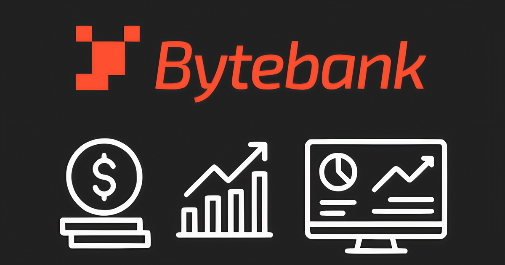

# 💻 Bytebank Pro – Microfrontends

Este repositório reúne a estrutura dos **microfrontends do Bytebank Pro**, desenvolvidos como parte do Tech Challenge da pós-graduação em Engenharia de Front-end (FIAP). O projeto utiliza **Turborepo** para orquestrar um monorepo com aplicações Angular independentes, promovendo escalabilidade, manutenção e desempenho.

<div style="max-width: 300px; margin: 0 auto; display: flex; justify-content: center; align-items: center;">
  
</div>

## 📝 Sumário

- [💻 Bytebank Pro – Microfrontends](#-bytebank-pro--microfrontends)
  - [📝 Sumário](#-sumário)
  - [📄 Desafio Original](#-desafio-original)
  - [🚀 URLs de Acesso](#-urls-de-acesso)
  - [✨ Visão Geral](#-visão-geral)
  - [📦 Tecnologias](#-tecnologias)
  - [🤖 Desenvolvimento com IA](#-desenvolvimento-com-ia)
    - [🛠️ Ferramentas de IA Utilizadas](#️-ferramentas-de-ia-utilizadas)
    - [📁 Configurações de IA](#-configurações-de-ia)
    - [🎯 Engenharia de Prompt](#-engenharia-de-prompt)
  - [📁 Estrutura do Monorepo](#-estrutura-do-monorepo)
  - [📦 Packages Compartilhados](#-packages-compartilhados)
  - [🛠️ Qualidade de Código](#️-qualidade-de-código)
  - [🔌 Comunicação entre Microfrontends](#-comunicação-entre-microfrontends)
  - [📋 Pré-requisitos](#-pré-requisitos)
  - [🚀 Ambiente de Desenvolvimento](#-ambiente-de-desenvolvimento)
  - [☁️ Implantação (Deploy)](#️-implantação-deploy)
    - [URL Final do Projeto](#url-final-do-projeto)
  - [🔗 Links Úteis](#-links-úteis)
  - [💡 Melhorias Futuras](#-melhorias-futuras)
    - [🤖 Melhorias com Inteligência Artificial](#-melhorias-com-inteligência-artificial)
    - [🛠️ Melhorias de Desenvolvimento](#️-melhorias-de-desenvolvimento)
  - [👥 Autor](#-autor)

---

## 📄 Desafio Original

O documento contendo os requisitos e objetivos do desafio original da pós-tech está disponível para consulta:

📌 [**POSTECH - Front-end - Tech Challenge - Fase 2**](./assets/POSTECH%20-%20Tech%20Challenge%20-%20Fase%202.pdf)

---

## 🚀 URLs de Acesso

- **Deploy:** [https://bytebank-pro.vercel.app](https://bytebank-pro.vercel.app)
- **API GraphQL:** [https://bytebank-api.onrender.com/graphql](https://bytebank-api.onrender.com/graphql)

> ⚠️ **Nota Importante sobre a API:** A API GraphQL está hospedada no Render utilizando o plano gratuito. Devido às limitações deste plano, a API pode demorar alguns segundos para responder na primeira requisição após um período de inatividade (quando o serviço "dorme"). As requisições subsequentes serão mais rápidas. Esta é uma limitação conhecida do plano gratuito do Render e não afeta a funcionalidade da aplicação.

---

## ✨ Visão Geral

A arquitetura é composta por um **Shell** (aplicação hospedeira) e três **Microfrontends (MFEs)**, cada um responsável por uma área de negócio específica.

| App              | Descrição                                                   | Readme                                            |
| :--------------- | :---------------------------------------------------------- | :------------------------------------------------ |
| **Shell**        | Orquestra os MFEs, gerencia autenticação e o layout global. | [Ver Documentação](./apps/shell/README.md)        |
| **Dashboard**    | Exibe o painel com informações financeiras do usuário.      | [Ver Documentação](./apps/dashboard/README.md)    |
| **Transactions** | Gerencia o cadastro, edição e listagem de transações.       | [Ver Documentação](./apps/transactions/README.md) |
| **Settings**     | Permite o gerenciamento da conta e preferências do usuário. | [Ver Documentação](./apps/settings/README.md)     |

---

## 📦 Tecnologias

- **Monorepo**: [Turborepo](https://turbo.build/)
- **Framework**: [Angular 20](https://angular.dev/)
- **Module Federation**: [@angular-architects/module-federation](https://github.com/angular-architects/module-federation)
- **Estilo**: [TailwindCSS](https://tailwindcss.com/)
- **API**: [GraphQL (Apollo Client)](https://www.apollographql.com/docs/angular/)
- **Contêineres**: [Docker](https://www.docker.com/) + [Docker Compose](https://docs.docker.com/compose/)
- **Qualidade de Código**: ESLint, Prettier, Husky, lint-staged

---

## 🤖 Desenvolvimento com IA

Este projeto também foi desenvolvido como uma oportunidade de **aprendizado e aperfeiçoamento** no uso de ferramentas de Inteligência Artificial para desenvolvimento de software. Durante todo o processo, foram utilizadas tecnologias de IA generativa para acelerar o desenvolvimento e melhorar a qualidade do código.

### 🛠️ Ferramentas de IA Utilizadas

- **[Cursor](https://cursor.sh/)**: IDE com Inteligência Artificial que sugere códigos de forma inteligente e oferece assistência contextual em tempo real, facilitando e acelerando o desenvolvimento.
- **[GitHub Copilot](https://github.com/features/copilot)**: Ferramenta de IA que auxilia na programação, fornecendo sugestões automáticas de código e agentes inteligentes para resolver tarefas de desenvolvimento de maneira mais eficiente.
- **[Gemini CLI](https://github.com/google-gemini/gemini-cli)**: Ferramenta de linha de comando que conecta com ferramentas de desenvolvimento, entende código e acelera workflows. Permite consultar grandes bases de código, gerar aplicações a partir de PDFs/esboços e automatizar tarefas operacionais usando IA generativa.

### 📁 Configurações de IA

O projeto inclui configurações específicas para otimizar o uso das ferramentas de IA:

- **`.cursor/`**: Contém configurações e prompts personalizados para o Cursor, incluindo regras de desenvolvimento e padrões de código específicos do projeto
- **`.github/`**: Inclui workflows e configurações que aproveitam recursos de IA do GitHub, como sugestões de código e análise automática
- **`GEMINI.md`**: Documentação de uso da Gemini CLI, com prompts e configurações específicas para o projeto

### 🎯 Engenharia de Prompt

Uma parte fundamental do desenvolvimento foi a **engenharia de prompt** - a prática de criar e refinar prompts específicos para obter os melhores resultados das ferramentas de IA. Isso incluiu:

- Definição de prompts estruturados para geração de componentes Angular
- Criação de templates de prompt para diferentes tipos de funcionalidades
- Refinamento contínuo baseado nos resultados obtidos
- Documentação de prompts eficazes para reutilização futura

Esta abordagem permitiu maximizar a produtividade e manter a consistência do código ao longo do desenvolvimento do projeto.

---

## 📁 Estrutura do Monorepo

O projeto é organizado em duas pastas principais: `apps` para as aplicações executáveis e `packages` para código compartilhado.

```
bytebank-pro/
├── apps/
│   ├── shell/          # Aplicação hospedeira (Container)
│   ├── dashboard/      # MFE de Dashboard
│   ├── transactions/   # MFE de Transações
│   └── settings/       # MFE de Configurações
└── packages/
    ├── ui/             # Biblioteca de componentes Angular
    ├── types/          # Definições de tipos TypeScript
    ├── utils/          # Funções utilitárias compartilhadas
    ├── eslint-config/  # Configurações de ESLint
    ├── typescript-config/ # Configurações de TypeScript
    └── shared-design-tokens/ # Design tokens (cores, fontes)
```

---

## 📦 Packages Compartilhados

Os `packages` garantem a consistência e reutilização de código em todo o projeto.

| Pacote                                   | Descrição                                                                 | Readme                                                        |
| :--------------------------------------- | :------------------------------------------------------------------------ | :------------------------------------------------------------ |
| **`@bytebank-pro/ui`**                   | Biblioteca de componentes Angular (standalone) para a UI.                 | [Ver Documentação](./packages/ui/README.md)                   |
| **`@bytebank-pro/types`**                | Define as interfaces e tipos TypeScript compartilhados.                   | [Ver Documentação](./packages/types/README.md)                |
| **`@bytebank-pro/utils`**                | Oferece funções utilitárias comuns (formatação, validação).               | [Ver Documentação](./packages/utils/README.md)                |
| **`@bytebank-pro/shared-design-tokens`** | Centraliza os design tokens (cores, tipografia) para consistência visual. | [Ver Documentação](./packages/shared-design-tokens/README.md) |
| **`@bytebank-pro/eslint-config`**        | Disponibiliza configurações padronizadas do ESLint.                       | [Ver Documentação](./packages/eslint-config/README.md)        |
| **`@bytebank-pro/typescript-config`**    | Fornece configurações base do TypeScript (`tsconfig.json`).               | [Ver Documentação](./packages/typescript-config/README.md)    |

---

## 🛠️ Qualidade de Código

O projeto utiliza um conjunto de ferramentas para garantir a consistência e a qualidade do código. **Prettier** e **ESLint** são executados automaticamente antes de cada commit com **Husky** e **lint-staged** para formatar e analisar os arquivos, prevenindo a introdução de erros e inconsistências.

---

## 🔌 Comunicação entre Microfrontends

A comunicação é feita através de duas estratégias principais:

1.  **Module Federation**: Para carregar os microfrontends dinamicamente.
2.  **Custom Events**: Para notificar o Shell e outros MFEs sobre eventos importantes (ex: `transactionCreated`).

---

## 📋 Pré-requisitos

Antes de começar, garanta que você tenha as seguintes ferramentas instaladas:

- **[Git](https://git-scm.com/)**: Para controle de versão do código.
- **[Node.js](https://nodejs.org/)**: Recomenda-se a versão 22 ou superior.
- **[Docker](https://www.docker.com/)**: Essencial para gerenciar o ambiente de desenvolvimento. Recomendamos o uso do [Docker Desktop](https://www.docker.com/products/docker-desktop/).

---

## 🚀 Ambiente de Desenvolvimento

Para configurar e executar o projeto localmente, siga os passos abaixo. O ambiente é gerenciado com **Docker Compose** para a API e **Turborepo** para os microfrontends.

1.  **Clone o repositório:**

    ```bash
    git clone https://github.com/Brendhon/bytebank-pro.git
    cd bytebank-pro
    ```

2.  **Instale as dependências:**

    ```bash
    npm install
    ```

3.  **Inicie o ambiente de desenvolvimento:**

    - **Ambiente Completo (API + MFEs):**
      Para subir a API GraphQL (com Docker) e todas as aplicações de frontend, execute:

      ```bash
      npm run dev
      ```

    - **Apenas os Microfrontends:**
      Se a API já estiver em execução ou se você estiver usando uma API remota, inicie apenas os MFEs:

      ```bash
      npm run dev:front
      ```

    - **Apenas a API (Docker):**
      Para iniciar somente a API GraphQL e o banco de dados MongoDB com Docker, use:
      ```bash
      npm run dev:api
      ```

4.  **Parando o ambiente Docker:**
    Para derrubar os contêineres da API, execute:

    ```bash
    npm run dev:stop
    ```

5.  **Configuração de Variáveis de Ambiente:**
    Para alterar as variáveis de ambiente dos projetos Angular (caso necessário), acesse a pasta `src/environments` dentro de cada projeto:

    ```bash
    # Exemplo para o projeto principal
    cd apps/shell/src/environments

    # Exemplo para outros microfrontends
    cd apps/dashboard/src/environments
    cd apps/transactions/src/environments
    cd apps/settings/src/environments
    ```

    Os arquivos `environment.development.ts` (desenvolvimento) e `environment.ts` (produção) contêm as configurações específicas de cada aplicação.

---

## ☁️ Implantação (Deploy)

As aplicações de frontend (Shell e Microfrontends) são implantadas na **[Vercel](https://vercel.com/)**. A Vercel foi escolhida por sua integração nativa com monorepos e otimizações específicas para **Turborepo**.

### URL Final do Projeto

O projeto final pode ser acessado em: `https://bytebank-pro.vercel.app/`

**Principais Vantagens:**

- **Builds Otimizados:** A Vercel detecta o Turborepo e utiliza seu cache de builds, acelerando o processo.
- **Deploy Inteligente com `turbo-ignore`:** A Vercel pode ignorar o build de uma aplicação se nenhuma alteração relevante for detectada, economizando tempo e recursos.

**Estratégia de Deploy:**

- Cada aplicação na pasta `apps/` é configurada como um projeto independente na Vercel, apontando para o mesmo repositório Git.
- O comando de build para cada projeto utiliza o filtro do Turborepo (ex: `turbo build --filter=dashboard`).

---

## 🔗 Links Úteis

- **API GraphQL**: A API hospedada no **[Render](https://render.com/)** está disponível em um [repositório separado](https://github.com/Brendhon/bytebank-api). Você pode acessá-la publicamente [aqui](https://bytebank-api.onrender.com/graphql).
- **Plataforma de Deploy (Frontend)**: As aplicações são implantadas na **[Vercel](https://vercel.com/)**.

---

## 💡 Melhorias Futuras

Este projeto está em constante evolução. Abaixo estão algumas ideias e sugestões para futuras melhorias, tanto com o uso de Inteligência Artificial quanto com práticas de desenvolvimento convencionais:

### 🤖 Melhorias com Inteligência Artificial

- **Validação de Padrões de Código com IA**: Utilizar IAs como o Gemini CLI para analisar Pull Requests e verificar se o código segue os padrões e diretrizes definidos no `GEMINI.md`. Isso pode incluir a verificação de nomes de componentes, uso de services, e a estrutura geral do código.
- **Geração de Testes Unitários**: Automatizar a criação de testes unitários para novos componentes e serviços, garantindo que a cobertura de testes seja mantida e que os testes sigam as melhores práticas.
- **Otimização de Performance com Análise de IA**: Usar ferramentas de IA para analisar o bundle final das aplicações e sugerir otimizações de performance, como a identificação de "dead code" ou a sugestão de "lazy loading" para módulos específicos.
- **Tradução Automatizada de Documentação**: Utilizar IA para traduzir a documentação do projeto para outros idiomas, tornando-o mais acessível para a comunidade global.

### 🛠️ Melhorias de Desenvolvimento

- **Testes End-to-End (E2E)**: Implementar testes E2E com ferramentas como o Cypress ou Playwright para simular a jornada do usuário e garantir a integração entre os microfrontends.
- **Monitoramento e Observabilidade**: Integrar ferramentas de monitoramento (ex: Sentry, Datadog) para capturar erros em tempo real e analisar a performance das aplicações em produção.
- **Design System Tokens**: Expandir o uso de design tokens para incluir espaçamentos, tamanhos de fontes e outros elementos de design, garantindo uma consistência visual ainda maior.
- **Storybook para Documentação de Design Patterns**: Utilizar o Storybook para documentar não apenas componentes, mas também "design patterns" e "recipes" de como combinar componentes para criar layouts e funcionalidades complexas.

---

## 👥 Autor

**Brendhon Moreira**

[LinkedIn](https://www.linkedin.com/in/brendhon-moreira) | [GitHub](https://github.com/Brendhon)
